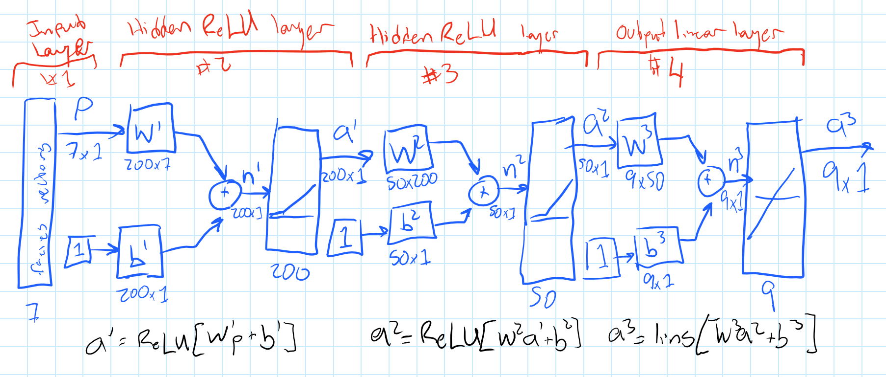

# Faye Picks Facies

Hi! My name's gram. My facies classifying robot's name is Faye.

<strong><a href="faye.ipynb">Click here</a> to see Faye in action.</strong>

Faye is written in <a href="https://www.lua.org/">Lua</a> using the <a href="http://torch.ch">Torch7</a> toolkit.

Here's a schematic description of Faye in abbreviated form:

She's a simple three layer forward-feed neural network with about 250 neurons.

If you've got any questions you can find my contact info at <a href="https://gra.m-gan.sl">gra.m-gan.sl</a>.
